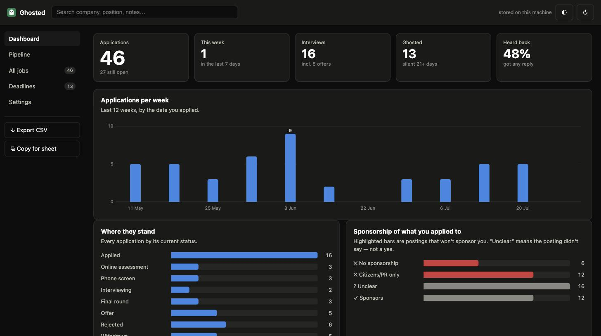
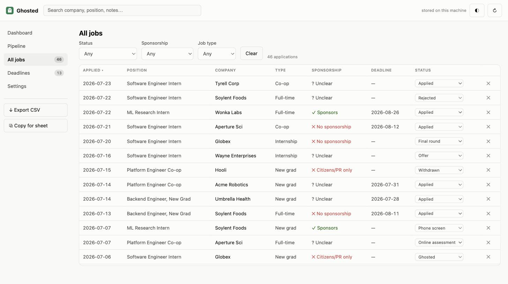

# Ghosted 👻

[](LICENSE)


Logs every job you apply to on Handshake, so you know exactly who ghosted you.

Apply to something on [Handshake](https://joinhandshake.com) and a small
confirmation box pops up with the job details already filled in. Add the two or
three things it can't know (which role bucket, whether you had a connection
there), hit Enter, and it's logged.

Free, no account, no sign-up, nothing to pay for. Google Sheets sync is
available if you want it, and optional.



*Screenshots use generated sample data.*

## Quick start

1. `chrome://extensions` → turn on **Developer mode** (top right) → **Load
   unpacked** → pick this folder.
2. Go apply to a job.
3. Click the ghost in the toolbar → **Open dashboard**.

That's it. Applications are saved on your own machine. No Google account, no API
keys, nothing to configure.

Connect a Google Sheet later if you want your applications mirrored somewhere
you can share and chart them — see [below](#optional-google-sheets-sync). Also
free.

Worth thirty seconds in **⚙ Options** either way: if you need visa sponsorship
leave that toggle on (it drives the pre-apply warnings), set your Role
dropdown options, and pick how many days of silence counts as ghosted.

## The dashboard

The dashboard is the tool; the browser extension is just the part that captures
jobs. Open it from the toolbar popup, or right-click the extension icon →
Options. It runs in its own tab, and it reads whichever copy of your data is
authoritative — the sheet if you've connected one, otherwise the local log.

- **Dashboard** — headline numbers (applied, this week, interviews, ghosted, and
  what share ever replied), applications per week, where everything stands, and a
  breakdown of how many of your applications went to employers who won't sponsor
  you. Plus what's due a follow-up and which deadlines are closing.
- **Pipeline** — a column per stage. Change a status and it writes straight back.
- **All jobs** — searchable, sortable, filterable table of everything, with the
  job URL on each row so you can reopen a posting that's since been pulled.

  

- **Deadlines** — what's closing, overdue first.
- **Needs attention** — one list of closing deadlines, overdue follow-ups and
  applications that have gone quiet, most urgent first.
- **Settings** — capture, follow-ups, sponsorship, weekly goal, optional sheet.

Light and dark themes with a toggle. Press <kbd>?</kbd> for keyboard shortcuts
(<kbd>/</kbd> to search, <kbd>g</kbd> then a letter to jump between views).

## What it does beyond logging

**Tells you about sponsorship before you apply.** If you need a visa, whether
the employer sponsors is the first thing that matters and it is usually buried in
boilerplate at the bottom of the posting. Ghosted reads the description and puts
a badge on the job page: *Sponsors visas*, *No
sponsorship*, *Citizens/PR only*, or *Sponsorship unclear*. Click the badge and
it shows you the exact sentence it matched, so you can judge for yourself. The
answer also lands in the sheet, so you can filter by it later.

Detection errs toward warning. A posting that says nothing is "unclear", never a
yes, and a clearance or ITAR requirement outranks a "we sponsor H-1B" line
elsewhere on the page.

Turning off "I need visa sponsorship" in settings hides the warnings; the column
is still recorded.

**Tracks follow-ups.** Every row gets a Follow-up On date, two weeks out by
default. A daily check counts what has gone quiet and notifies once.

**Reports outcomes.** Running totals for applied, this week, interviews, ghosted,
and the share that ever got a reply. Silence past 21 days counts as ghosted;
configurable.

**Catches the deadline.** "Apply by" dates get scraped and stored, so a rolling
list of postings has actual dates on it.

## The columns

One row per application, 21 fields:

`Position | Company | Industry | Role | Location | Date Posted | Date Applied | Connections? | Cover Letter | Résumé upload? | Résumé Form? | Salary Range | Notes | Status | Latest word | Job Type | Sponsorship | Deadline | Follow-up On | Job URL | Job ID`

These are the CSV/TSV export headers, and the sheet header row if you connect
one.

## Import and export

The sidebar has **Import CSV / JSON**, **Export CSV** and **Copy for sheet**.

Import accepts what the export writes, a Google Sheets or Excel export, or a JSON
backup. Header order and casing don't have to match and unknown columns are
skipped, so a spreadsheet you'd already been keeping by hand will load. Rows are
matched on Handshake job id when there is one and on company + position + date
otherwise; anything already present is skipped rather than duplicated, and an
existing row is never overwritten — so re-importing can't clobber a status you
set yourself.

## Where your applications live

Every application is written to the extension's own storage first, always. That
copy is the source of truth: it needs no account, works offline, and means a
failed sheet sync can never lose a row you already filled in.

The dashboard reads and edits that copy directly, and the sidebar has
**Export CSV** and **Copy for sheet** (tab-separated, so it pastes cleanly into
Sheets, Excel or Numbers). The local log holds the 2000 most recent
applications.

## The hosted dashboard

The dashboard also runs as a plain web page, with no install:

```sh
npm run serve      # then open http://localhost:8731/
```

Or deploy it. `vercel.json` serves the repo root and rewrites `/` to the landing
page and `/app` to the dashboard:

```sh
npx vercel deploy --prod
```

The hosted build reads a copy kept in that browser's `localStorage`, so export a
CSV from the extension and import it to browse your data on a machine without the
extension. Capture, sponsorship scanning, reminders and Sheets sync need the
extension — they have to run in the browser on the Handshake page — and the
settings that depend on them are hidden automatically.

The same `app/app.html`, `app/app.js` and `shared/utils.js` serve both. The only
difference is `app/data-source.js`, which picks a storage backend based on
whether `chrome.runtime.id` exists.

## Optional: Google Sheets sync

Skip this entirely if you don't want it. Nothing above depends on it.

Connecting a sheet mirrors every application into a spreadsheet you can share,
chart, filter, or edit from your phone. Once connected, the sheet becomes the
copy the stats read from, since that's where you'll be updating Status.

**It costs nothing.** The Google Sheets API is not a metered service — there's
no per-request charge and no billing account required, so there's nothing to
autopay and no card to put on file. You get rate limits (300 requests/minute)
instead of a bill, and this extension uses roughly one write per application.
The Cloud Console will show "activate your full account" banners; ignore them.
The only thing Google charges for anywhere near this is the $5 one-time fee to
*publish* an extension to the Web Store, which you're not doing.

What the setup buys you is an OAuth client, which is the only way Google will
hand out access to your own spreadsheet.

**Sharing with someone else:** because the extension ID is pinned, one OAuth
client covers every install. Create it once, commit the client ID, and add their
Google address under **Test users** on the consent screen. They load the
extension and click Connect — no Cloud Console for them. The consent screen
allows 100 test users while unverified.

### 1. Get the extension ID

Already done if you loaded it above. The ID is pinned in `manifest.json`, so
it's always:

```
lkfokghblcgjphlkjlfpfgcdhpbfdldp
```

That matters because the OAuth client is tied to the ID. Pinning it means you
can move this folder, reinstall, or clone it on another machine without redoing
step 2. If you loaded the extension before this ID was pinned, hit the reload
(↻) icon on the card and check that the ID now matches the string above.

### 2. Make a Google Cloud project

1. Go to <https://console.cloud.google.com/> and sign in with the account that
   owns the spreadsheet.
2. Project dropdown in the top bar → **New Project**. Name it whatever
   ("Ghosted" works). Create it, then make sure it's the selected project.
3. **APIs & Services → Library**, search for **Google Sheets API**, open it,
   click **Enable**.
4. **APIs & Services → OAuth consent screen**. Pick **External** → Create.
   Fill in the app name and your email where required, then save through the
   rest of the screens.
   - On the **Test users** screen, add your own Google address. Skip this and
     sign-in gets blocked, because the app is in "Testing" status.
5. **APIs & Services → Credentials → Create Credentials → OAuth client ID**.
   - Application type: **Chrome Extension**
   - Item ID: `lkfokghblcgjphlkjlfpfgcdhpbfdldp`
   - Create. Copy the **Client ID** it shows you (ends in
     `.apps.googleusercontent.com`).

### 3. Paste the client ID in

In `manifest.json`, replace the placeholder:

```json
"oauth2": {
  "client_id": "1234567890-abcdefg.apps.googleusercontent.com",
  "scopes": ["https://www.googleapis.com/auth/spreadsheets"]
}
```

Then go back to `chrome://extensions` and hit reload (↻) on the card. The
manifest is only read at load time, so skipping the reload means the old
placeholder is still live.

### 4. Point it at your sheet

Open the dashboard → **Settings** → the **Google Sheets sync** section.

1. Paste your spreadsheet URL (the ID gets parsed out of it) and the tab name,
   e.g. `Sheet1` or `Applications`.
2. Click **Connect Google & verify sheet**. A Google window opens — approve the
   Sheets permission. You'll see an "unverified app" warning, which is expected
   for a personal OAuth client; continue past it.

It reads row 1 of your tab. An empty tab gets the header written for you. A tab
whose headers don't match is left completely alone. A sheet from an earlier
version with only the original 15 columns gets the six newer headers appended,
with existing rows untouched — new columns are only ever added at the end.

The status line then says one of:

- **headers verified** — done, go apply to something.
- **header row written** — the tab was empty, so it wrote the header for you.
- **added the new columns** — your sheet was from an older version; the newer
  headers got appended and existing rows were left alone.
- **headers don't match** — it lists expected vs. found. Fix the sheet by hand;
  nothing was overwritten.

## Check the scraping before you trust it

Worth doing once, and it costs nothing. Open any Handshake job page and click
the floating **＋ Log this job** button. The overlay opens with everything it
managed to scrape. Press **Esc** and nothing is saved anywhere.

Anything highlighted amber is a selector that needs fixing for your school's
Handshake. See "When Handshake changes" below. Try it on three or four
different jobs — one remote, one with no salary listed — before relying on
automatic capture.

## Daily use

**Automatic.** Apply to a job. When the confirmation appears (or you click an
external-apply link), the overlay pops up pre-filled. Fill in Role,
Connections?, Résumé Form?, Notes. Enter saves, Esc skips. Amber fields are
ones it couldn't scrape.

**Manual.** The floating **＋ Log this job** button on any job page,
**⌘/Ctrl+Shift+L**, the right-click menu, or the toolbar popup.

**Keeping it current.** Status is a dropdown — Applied, Online assessment,
Phone screen, Interviewing, Final round, Offer, Rejected, Withdrawn, Ghosted.
Editing it later in the sheet is what makes the stats mean anything, since
"never heard back" is inferred from a row still sitting at Applied.

**Offline.** Rows that fail to save go into a queue in local storage and retry
on their own with backoff (1, 2, 4 … up to an hour). The toolbar badge shows
how many are waiting. You can force a retry from the popup or the options page.
A row you filled in never gets thrown away, even if the save fails.

**Duplicates.** Every logged job ID is remembered for a year. Log the same job
twice and the overlay warns you, with the button changing to "Save anyway". It
also reports when you're applying to the same company again.

## When Handshake changes

Everything Handshake-specific is in `content/selectors.js` — job title,
company, location, salary, posted date, deadline, description, the success-toast
wording, the external-apply link text. Each field is an ordered list, most
reliable first. `content/content.js` also checks for `application/ld+json`
JobPosting data before it touches a CSS selector at all.

The sponsorship phrase lists are the exception: they live in `shared/utils.js`
as `WORK_AUTH_RULES`, because they're employer boilerplate rather than anything
to do with Handshake's markup. Add a phrasing you've run into and add a case to
`test/utils.test.js` alongside it.

If a field stops scraping:

1. Open a job page, right-click the value that's missing, **Inspect**.
2. Look for a `data-hook` or `data-testid` on or near the element and add it to
   the **front** of the matching list in `selectors.js`.
3. Reload the extension, then re-test with the ＋ button.

Nothing else should need touching.

## Layout

```
manifest.json          MV3 manifest (paste your OAuth client ID here)
background.js          service worker: OAuth, Sheets calls, retry queue, badge
shared/utils.js        schema, date parsing, sanitization — used by both sides
content/urlwatch.js    MAIN-world script, hooks pushState for SPA navigation
content/selectors.js   every Handshake selector, all in one place
content/content.js     detection, scraping, the confirmation overlay
app/                   the dashboard: views, charts, settings
popup/                 toolbar popup: manual log, quick stats, dashboard launcher
app/data-source.js     storage backend: extension worker or localStorage
web/index.html         landing page for the hosted build
icons/                 generated, don't hand-edit
tools/make-icons.js    regenerates icons/ (npm run icons)
test/utils.test.js     unit tests (npm test)
test/browser.html      browser integration suite
```

## Architecture

See [ARCHITECTURE.md](ARCHITECTURE.md) for the component layout, trust
boundaries, per-user isolation, and the cost analysis at scale.

## Tests

```sh
npm test
```

```sh
npm test           # 226 unit tests, no dependencies, no browser
npm run serve      # then open http://localhost:8731/test/browser.html
```

The unit tests cover the pure logic in `shared/utils.js`: date normalization,
sponsorship classification, formula escaping, spreadsheet ID parsing, column
ordering, dedupe pruning, stats, CSV/TSV export, the import parser and merge.

The browser suite is 50 integration tests that drive the real dashboard in an
iframe against real `localStorage` — KPI arithmetic, chart geometry, filters,
sorting, search, status writes, delete and undo, import, theme persistence,
routing, the empty state, and corrupt-storage handling. It needs no test hooks in
production code.

Everything that needs a real browser — scraping, submission detection, OAuth,
the retry queue — is in [TESTPLAN.md](TESTPLAN.md) as a manual checklist.

## Charts

The three dashboard charts follow a deliberate colour discipline, which is why
they look plain:

- **Applications per week** is one hue, because a single series comparing
  magnitude over time has no identity to encode. Only the peak is labelled; the
  rest is axis ticks and hover.
- **Where they stand** is also one hue. Colouring nine status bars nine different
  ways, or shading them darker-where-bigger, would spend the colour channel on
  information the bar length already carries.
- **Sponsorship** uses the emphasis form: postings that can't hire you are in
  the critical red, everything else recedes to gray. A green/red pair measures
  ΔE 4.1 under deuteranopia against a threshold of 8, so the two most important
  categories would be indistinguishable for a red-green colourblind reader.
  Every verdict also carries a glyph and a text label.

The palette is validated against both the light and dark surfaces rather than
checked by eye.

## Icons

`icons/*.png` are generated, not drawn. Edit the constants at the top of
`tools/make-icons.js` and run `npm run icons`. It rasterizes the ghost into a
supersampled buffer and writes PNGs using only `node:zlib`.

## Privacy

- Applications are stored locally in the extension, and go nowhere else unless
  you connect a sheet. There is no server, no analytics, and no account.
- OAuth tokens live in the service worker. Content scripts never see one.
- The only scope requested is `spreadsheets`. No Drive access, so it can't see
  any of your other files.
- Job descriptions are scanned in the page for sponsorship language and thrown
  away. Only the verdict is stored, and only in your own sheet. Nothing is sent
  anywhere except Google Sheets.
- Scraped text is trimmed, and a leading `=` `+` `-` `@` gets an apostrophe
  before it's written, so a job title can't inject a formula into your sheet.

## Any university

Nothing here is school-specific. The content scripts match
`https://*.joinhandshake.com/*`, which covers `app.joinhandshake.com` and every
school subdomain, plus `joinhandshake.co.uk` and `joinhandshake.de`. The
scraping targets Handshake's own DOM, which is the same everywhere.

## If you fork this

The friction point is OAuth. `chrome.identity.getAuthToken` needs a client
whose Item ID matches the installed extension.

Because the public key is pinned in `manifest.json`, every unpacked install of
this repo gets the same ID, so one OAuth client works across your machines. A
fork that wants its own identity should generate a new key:

```sh
openssl genrsa -out key.pem 2048
openssl rsa -in key.pem -pubout -outform DER | openssl base64 -A
```

Put that base64 string in the manifest's `key` field. `key.pem` itself is
gitignored and only needed if you ever pack a `.crx` — the `key` field alone is
what fixes the ID.

Publishing to the Chrome Web Store would give everyone the same ID for free,
but the `spreadsheets` scope counts as sensitive, so the consent screen needs
Google's verification before it can serve more than 100 users. Until then it's
test-users-only with an unverified-app warning.

Don't commit a real spreadsheet ID. Your config lives in `chrome.storage.sync`,
never in the repo.

MIT licensed. See [LICENSE](LICENSE).
